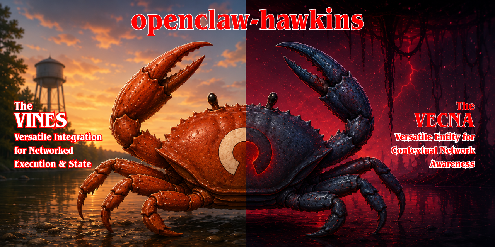

<p align="center">
  
</p>

# 🦞 openclaw-orchestra — Multi-Agent Orchestration for OpenClaw (LLM-Powered Autonomous Workflows)

[](https://github.com/parijatmukherjee/openclaw-orchestra/actions/workflows/ci.yml)
[](https://codecov.io/gh/parijatmukherjee/openclaw-orchestra)
[](https://nodejs.org)
[](https://www.typescriptlang.org)
[](https://prettier.io)
[](https://eslint.org)
[](LICENSE)
[](https://github.com/parijatmukherjee/openclaw-orchestra/stargazers)

**🎼 Drop-in multi-agent orchestration pattern for [OpenClaw](https://openclaw.ai), with an optional durable-state layer powered by MariaDB + Linear.**

> ⭐ **Find this useful?** Hit the star button up top — it helps other OpenClaw operators discover the pattern, and it tells me whether to keep iterating on it. Thank you. 🙏

What you get, in one paragraph: one conversational **orchestrator** + six isolated specialist agents (🔧 `system`, ⌨️ `code`, 🔍 `research`, 📊 `data`, ✉️ `comm`, 👁️ `vision`). The operator only ever talks to the orchestrator. Specialists do the heavy lifting in their own workspaces, with their own memory and tools. Layered on top — and entirely optional — is **ASO** (Agentic Swarm Orchestrator), a Node/TypeScript library that adds 📋 Linear-backed ticket oversight, a `orchestration_ledger` row per request in MariaDB, an activation gate (spec §3.1), and crash-resilient resume (spec §4.2).

```
┌─────────────────────────────────────────┐
│   🎼 Orchestrator (agent:main)           │
│  - Talks to the operator                │
│  - Picks the right specialist           │
│  - Dispatches via `openclaw agent`      │
│  - Synthesizes + reports                │
└─────────────────┬───────────────────────┘
                  │
    ┌─────────────┼─────────────┬─────────────┐
    │             │             │             │
┌───▼────┐  ┌────▼────┐  ┌────▼────┐  ┌────▼────┐
│🔧system│  │⌨️ code  │  │🔍research│  │📊 data  │  …
│ agent  │  │ agent   │  │ agent   │  │ agent   │
└────────┘  └─────────┘  └─────────┘  └─────────┘
```

---

## 🚀 Two ways to install

### 🤖 Let an AI agent install it for you

> ⚡ **This repo ships with a [`SKILL.md`](SKILL.md)** — an OpenClaw skill manifest that any capable agent (your existing OpenClaw orchestrator, or any AI assistant with shell access on the host) can use to install and configure this pattern end to end.

🪄 **Step 1.** Drop the skill into your workspace:

```bash
mkdir -p ~/.openclaw/workspace/skills/openclaw-orchestra-installer
curl -fsSL https://raw.githubusercontent.com/parijatmukherjee/openclaw-orchestra/main/SKILL.md \
  > ~/.openclaw/workspace/skills/openclaw-orchestra-installer/SKILL.md
```

💬 **Step 2.** Ask your agent:

> "Install openclaw-orchestra on this host."

✨ The skill walks the agent through prerequisite checks, repo clone, agent creation, workspace overlay, optional Linear wiring, and end-to-end smoke tests. It will ask you the personalization questions (orchestrator name, vibe, host facts) before making changes.

💡 If you don't have a working orchestrator yet, you can paste the contents of `SKILL.md` into any shell-capable AI assistant running on the target host.

---

### 🧑 Install it yourself

⏱️ The human path takes ~5 minutes:

```bash
# 1️⃣ Clone
git clone https://github.com/parijatmukherjee/openclaw-orchestra.git ~/openclaw-orchestra
cd ~/openclaw-orchestra

# 2️⃣ Create the 6 specialist agents
./scripts/setup.sh

# 3️⃣ Personalize each specialist's identity
for id in system-agent code-agent research-agent data-agent comm-agent vision-agent; do
  cp agents/$id/IDENTITY.md.template ~/.openclaw/agents/$id/workspace/IDENTITY.md
done
# then edit each ~/.openclaw/agents/<id>/workspace/IDENTITY.md
# (fill in your name + host)

# 4️⃣ Install the orchestrator workspace files
cp orchestrator/AGENTS.md       ~/.openclaw/workspace/AGENTS.md
cp orchestrator/TOOLS.md.template ~/.openclaw/workspace/TOOLS.md     # then edit
cp orchestrator/IDENTITY.md.template ~/.openclaw/workspace/IDENTITY.md  # then edit

# 5️⃣ Restart and smoke-test
openclaw gateway restart
openclaw agent --agent system-agent --message "Introduce yourself in one line." --json --timeout 30
```

📖 Full step-by-step (including the optional Linear integration) is in **[INSTALL.md](INSTALL.md)**.

---

## ✅ Prerequisites

**Specialist pattern (the minimum):**

- 🐚 **OpenClaw ≥ 2026.5.7** with the gateway running. Check: `openclaw --version` and `openclaw gateway status`.
- 🧠 **At least one working model with auth.** Defaults assume `ollama/kimi-k2.6:cloud` (text) and `ollama/kimi-k2.5:cloud` (vision). Substitute OpenAI / Groq / any Anthropic-compatible provider / etc. via env vars to `setup.sh`.

**Optional add-ons:**

- 📋 A **Linear** account (any plan) if you want ticket oversight. The CLI reads its API key from `$LINEAR_API_KEY` by default; if you'd rather keep the key in 1Password, the [`op` CLI](https://developer.1password.com/docs/cli/) is a supported fallback (see `orchestrator/LINEAR.md`). Neither `op` nor a 1Password account is required.
- 🟢 **Node ≥ 20** + a **MariaDB** instance (local or cloud, TLS supported including self-signed via `MARIADB_SSL=insecure`) if you want the **ASO** durable-state layer.

---

## 🔀 How dispatch works

The orchestrator runs this in its `exec` tool whenever it needs a specialist:

```bash
openclaw agent --agent <id> --message "<task>" --json --timeout <seconds>
```

The response is structured JSON. The orchestrator parses `result.payloads[0].text`, synthesizes it into its own voice, and replies to the operator.

📜 A typical conversation flow:

```
🗣️ operator: "Install Docker and confirm the daemon is running."
   ↓
🎼 orchestrator: "Delegating to system-agent — expect ~2 min."
   ↓ (dispatches in background; remains responsive in chat)
   ↓
🔧 system-agent: returns a structured report
   ↓
🎼 orchestrator: "Done. Docker 26.1 installed, daemon active. (Ticket DOB-12)"
```

If Linear is wired up, a parent ticket + sub-ticket(s) record this whole chain on your board.

---

## 🎭 What you get

Six specialist agents, each isolated:

|     | Agent            | Scope                                                          | Default model                             |
| --- | ---------------- | -------------------------------------------------------------- | ----------------------------------------- |
| 🔧  | `system-agent`   | apt, systemd, ufw, cron, disk, logs, host config               | `ollama/kimi-k2.6:cloud`                  |
| ⌨️  | `code-agent`     | software dev, debugging, testing, git                          | `ollama/kimi-k2.6:cloud`                  |
| 🔍  | `research-agent` | web research, comparisons, sourced reports                     | `ollama/kimi-k2.6:cloud`                  |
| 📊  | `data-agent`     | CSV/JSON/Excel parsing, analysis, charts                       | `ollama/kimi-k2.6:cloud`                  |
| ✉️  | `comm-agent`     | email/chat drafts, calendar (always drafts — never auto-sends) | `ollama/kimi-k2.6:cloud`                  |
| 👁️  | `vision-agent`   | image analysis, OCR, screenshots                               | `ollama/kimi-k2.5:cloud` (vision-capable) |

Each one is a **true top-level OpenClaw agent** (`openclaw agents add <id>`) — not a subagent — with its own `~/.openclaw/agents/<id>/workspace/`, its own memory dir, its own scoped persona in `AGENTS.md`.

---

## 🤔 Why this pattern?

A single OpenClaw agent that "does everything" hits two walls quickly:

1. 🧱 **Context bloat.** Every tool, every memory, every skill loads on every turn. Trivial routing decisions pay the same token cost as deep domain work.
2. 🪞 **No real specialization.** Subagents share the parent's workspace and memory — isolation is conventional, not structural.

✨ This pattern solves both:

- 🪶 The orchestrator stays lean: routing + light conversation + quick lookups (≤30s inline).
- 🧱 Specialists are independent processes with their own contexts. Their memory and learning accumulate per-domain.
- 🎯 Dispatch is one CLI command. Response is structured JSON. The orchestrator handles the synthesis.

---

## 📋 Optional: Linear oversight

[Linear](https://linear.app) gives the operator a live view of what the orchestrator is doing. Wire it up and every non-trivial dispatch creates:

- 🗂️ a **parent ticket** per operator request,
- 📌 a **sub-ticket** per specialist dispatch,
- 💬 **comments** with each specialist's reply,
- 🚦 **state transitions** (In Progress → Done) tracking the lifecycle.

🤫 Trivial inline-handled requests (jokes, weather, ≤30s lookups) don't get tickets, so the board doesn't fill with noise.

Setup is in [orchestrator/LINEAR.md](orchestrator/LINEAR.md). CLI is [tools/linear-ticket](tools/linear-ticket) (Node ≥ 20, built-ins only — no `npm install` needed for this file to run).

---

## 🧠 Durable orchestration with **ASO** (Agentic Swarm Orchestrator)

The orchestrator pattern above is stateless: a crash mid-flight loses the plan. **ASO** is an optional Node/TypeScript library bundled in this repo that adds **durable state in MariaDB + Linear-backed recovery** to the same pattern, implemented from the canonical [`aso/spec.md`](aso/spec.md).

What you get:

- 💾 **Survives restarts.** A single `orchestration_ledger` row per request; recovery scans for unfinished runs on startup and cross-references Linear for the resume point.
- 🚦 **Activation gate.** Spec §3.1: protocol fires when work is estimated > 30 s **or** spans > 2 specialist domains. Trivial inline requests bypass it.
- 🔍 **Operator visibility.** `aso status` and `aso recover` give a live view of the swarm without opening Linear.
- 🧪 **Quality bar.** Strict TypeScript, vitest with 99 % statement coverage, ESLint + Prettier + shellcheck enforced in CI.

Install (after MariaDB is available — local or cloud):

```bash
make install                             # npm ci / npm install
make build                               # compile TypeScript → dist/
export MARIADB_URL=mariadb://h:3306/orchestra
export MARIADB_USER=orchestra
export MARIADB_PASSWORD=...
export LINEAR_API_KEY=lin_api_...
make bootstrap-db                        # apply aso/schema.sql
npx aso status                           # confirm the ledger is reachable
```

The spec, the schema, and every env var are documented in [`aso/spec.md`](aso/spec.md). The library API surface (CLI + importable `Orchestrator` / `Ledger` / `LinearClient`) is in [`src/`](src/).

---

## ➕ Adding a new specialist

1. 🆔 Pick an id (kebab-case, e.g. `media-agent`).
2. 🏗️ Create the agent: `openclaw agents add media-agent --non-interactive --model <model> --workspace ~/.openclaw/agents/media-agent/workspace`
3. 📝 Drop in an `AGENTS.md` (use any specialist's as a starting point — same structure, different scope).
4. 🎭 Personalize `IDENTITY.md`.
5. 📚 Add it to the registry table in `~/.openclaw/workspace/AGENTS.md` (your orchestrator's workspace doc).
6. 🔄 Restart gateway. 🧪 Smoke-test.

---

## 📁 Repository layout

```
openclaw-orchestra/
├── 🤖 SKILL.md                 # AI agent installer manifest
├── 📖 README.md                # You are here
├── 📘 INSTALL.md               # Detailed human install guide
├── 🧪 CHANGELOG.md             # Notable changes
├── 🤝 CONTRIBUTING.md          # How to contribute
├── 🛡️  SECURITY.md             # Vulnerability disclosure
├── ⚖️  LICENSE                 # MIT
├── 🧰 Makefile                 # Operator + developer entrypoints
├── 📦 package.json             # npm package metadata, scripts, deps
├── 🧠 aso/                     # ASO library — canonical contract
│   ├── spec.md                 # The specification (source of truth)
│   └── schema.sql              # `orchestration_ledger` table
├── 🧱 src/                     # ASO TypeScript implementation
│   ├── persistence.ts          # MariaDB ledger CRUD
│   ├── linear-client.ts        # Linear GraphQL client
│   ├── dispatcher.ts           # openclaw agent --json wrapper
│   ├── orchestrator.ts         # §3 protocol engine + §3.1 triage
│   ├── recovery.ts             # §4.2 cross-reference + resume
│   └── cli.ts                  # `aso` CLI
├── 🧪 tests/                   # vitest suites; coverage gated in CI
├── 🎼 orchestrator/            # Goes into your main agent's workspace
│   ├── AGENTS.md               # Dispatch protocol + architecture
│   ├── TOOLS.md.template       # Tool surface (template)
│   ├── IDENTITY.md.template    # Orchestrator identity (template)
│   └── LINEAR.md               # Optional ticket oversight protocol
├── 🎭 agents/                  # One subdir per specialist
│   ├── system-agent/   🔧
│   │   ├── AGENTS.md           # Scoped persona
│   │   └── IDENTITY.md.template
│   ├── code-agent/     ⌨️
│   ├── research-agent/ 🔍
│   ├── data-agent/     📊
│   ├── comm-agent/     ✉️
│   └── vision-agent/   👁️
├── 🧩 skills/                  # Per-specialist skill manifests
├── 🛠️  tools/
│   ├── linear-ticket           # Linear CLI (Node, built-ins only)
│   └── linear.json.template    # Linear config template
└── 🚀 scripts/
    ├── setup.sh                # Specialist-agent bootstrap
    └── bootstrap-aso-db.sh     # Apply aso/schema.sql via mariadb client
```

---

## 📐 Conventions

- 🗣️ **Orchestrator = the only conversational endpoint.** The operator talks only to the orchestrator. Specialists never address the operator directly.
- ⏱️ **30-second rule.** Anything the orchestrator can answer in ≤30s of inline tool use → answer inline. Everything else → dispatch.
- 🚦 **Parallel cap.** No more than 2 specialist dispatches in flight at once. Sequential by default.
- 🩹 **Failure handling.** Specialist timeouts and errors get surfaced in plain language with next-step options. No raw stack traces at the operator.
- 🔒 **No secrets** in tickets, comments, or specialist replies passed through. Truncate or redact before logging.

---

## 🧪 Quality

Each badge at the top of this README maps to a real, enforced gate:

| Badge                         | What it guarantees                                                                                                                                                                                              |
| ----------------------------- | --------------------------------------------------------------------------------------------------------------------------------------------------------------------------------------------------------------- |
| 🟢 **CI**                     | Every push and PR runs the full pipeline below on Node 20 and 22. PRs cannot merge red.                                                                                                                         |
| 📊 **Coverage**               | `vitest --coverage` with v8 — gated at **statements ≥ 95 %, functions ≥ 95 %, branches ≥ 90 %, lines ≥ 95 %**. Falling below these fails CI. Latest run: statements 99.14 %, functions 100 %, branches 92.77 %. |
| 📘 **TypeScript: strict**     | `tsconfig.json` enables `strict`, `noUnusedLocals`, `noUnusedParameters`, `exactOptionalPropertyTypes`, `useUnknownInCatchVariables`, `noImplicitOverride`.                                                     |
| 💅 **Code style: Prettier**   | `npm run format:check` runs in CI.                                                                                                                                                                              |
| 🧹 **Lint: ESLint**           | Flat config with `typescript-eslint` _recommended-type-checked_. PRs with lint errors fail CI.                                                                                                                  |
| 🐚 **(Hidden)** Shell scripts | `shellcheck` runs against `scripts/` in CI.                                                                                                                                                                     |

### Run the suites locally

```bash
make install           # one-time
make check             # lint + format-check + typecheck + tests (the CI gate)
make coverage          # tests with coverage thresholds enforced
make smoke             # smoke tests against real MariaDB / Linear / openclaw
                       # (auto-skipped when env vars are absent — see CONTRIBUTING.md)
```

The smoke suite under `tests/smoke/` exists _in addition_ to the hermetic unit suite. It's gated on env-var presence (`MARIADB_URL`, `LINEAR_API_KEY`, …) so contributors can run `make check` safely without any secrets while operators can verify the wiring end-to-end with real services.

---

## ⭐ One more thing

If `openclaw-orchestra` saved you from a tangled single-agent setup, **please [star the repo](https://github.com/parijatmukherjee/openclaw-orchestra/stargazers)** — it's the only signal I get that the pattern is landing for people, and it surfaces it to other OpenClaw operators. 🙏

PRs welcome too. Especially: async dispatch, per-agent skill scoping, alternative ticket backends (GitHub Issues / Notion / Plane), and adapters for other agent runtimes.

---

## ⚖️ License

📜 MIT. Use it, fork it, change everything.

---

## 🙏 Credits

🌱 Pattern crystallized while wrestling with a single-agent setup that kept hitting context limits.

🧩 The agent-skill manifests in `skills/` are adapted from the [agent-orchestrator](https://github.com/lcp14262/agent-orchestrator) ClawHub skill (MIT-0) by lcp14262.

🦞 OpenClaw is at [openclaw.ai](https://openclaw.ai).
